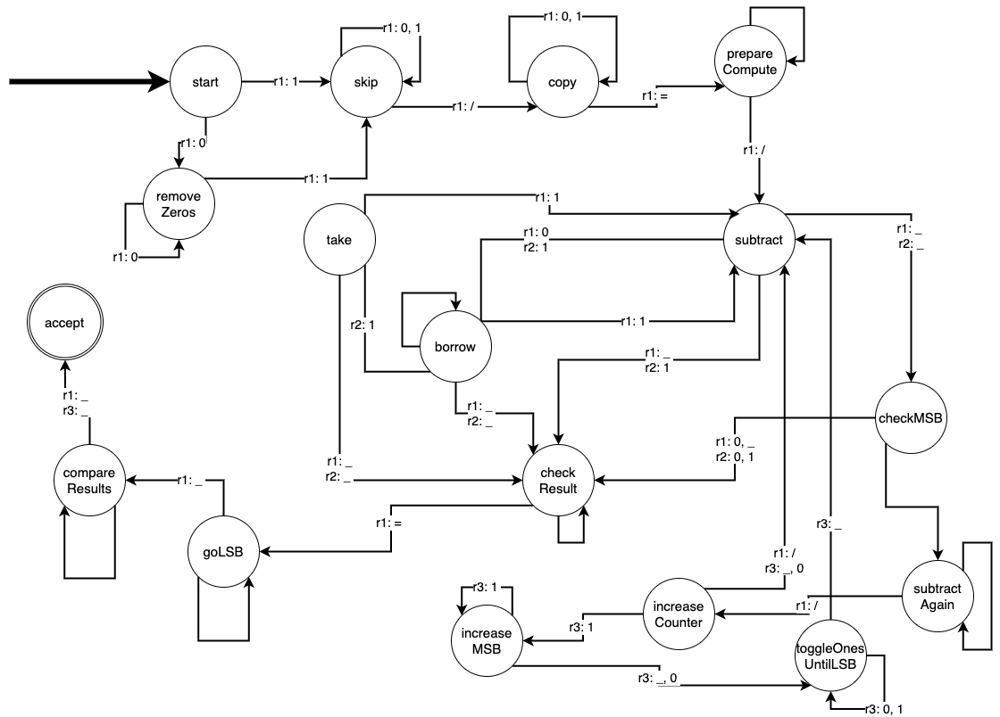

# Theory of Computation  
**Author:** Matteo Ghilardini

---

## Assignment 1

### Problem 1

This Turing Machine operates over the alphabet $\{0,1\}$ and accepts strings in the language $\{0^n 1^m \lor 1^m 0^n | m=n\}$, i.e., strings containing an equal number of `0`s and `1`s.

The machine starts in the `start` state. If it reads a `0` or `1`, it marks it (`x` or `y`) and transitions to `have0` or `have1`, looking for a matching opposite symbol. It skips over already marked symbols (`x`, `y`) and, if it reaches a blank (`' '`), enters the `accept` state.

In `have0`, it scans right for a `1`. If found, it marks it as `y` and returns to `back`. If it reaches a blank first, it rejects the input.

In `have1`, it works symmetrically, looking for a `0` to mark as `x`.

The `back` state moves the head left, back to the beginning, then re-enters `start`. The process repeats until all symbols are matched. If there's an imbalance, the machine transitions to `reject`.

### Problem 2

This TM works over the alphabet $\{a, b, c, d, e, f, \#, |\}$ and checks whether a word (before `|`) is present in an array of words (after `|`), separated by `#`.

  
**To simplify the graph, only transitions for letters `a` and `b` are shown; the code handles all letters from `a` to `f`.**

It begins in `start`, immediately rejecting if the first symbol is not a valid letter. It moves to `checkFormat` to ensure that the `|` separator appears before any `#`. If not, the input is rejected.

In `arrayFormat`, it expects at least one `#` after `|`. Once a `#` is read, it transitions to `haveHash`.

`checkLetter` marks a letter from the candidate word as `x` and transitions to a corresponding `haveX` state (e.g., `haveA`). If a candidate word is too short (i.e., reaches `#`), it transitions to `reset`.

In `haveX`, the machine moves left to search for the corresponding letter in the original word using `searchX` states. If found, it marks it with an uppercase version (e.g., `a → A`) and enters `letterFound`; if not, it enters `noMatch`.

`letterFound` decides whether to continue matching or move to `checkFullMatch` if the original word is fully processed.

`checkFullMatch` resets uppercase letters in the candidate and moves right until it finds an `x`, then transitions to `isCompleteMatch`.

If the candidate ends right after the matched word (`#` or `|`), the machine enters `accept`. Otherwise, it transitions to `nextWord`.

`nextWord` and `clearWord` clean up the evaluated candidate and prepare for the next one. If no match is found after scanning the whole array, the machine transitions to `reject`.

### Problem 3

This TM operates on the alphabet $\{0,1,-,=\}$ and recognizes strings of the form $a - b = c$, where $a, b, c \in \{0,1\}^+$ and $c = a - b$ (binary subtraction, no negatives).

  
**Only key transitions are shown; unlabeled transitions represent all other cases.**

The machine begins in `start`, rejecting if the first symbol is `-`. Otherwise, it copies operand `a` from tape 1 to tape 2 until `-` is found, entering `hasMinus` to validate structure.

Then in `skipNumber`, it positions for subtraction. In `subtract`, bitwise subtraction is performed between tape 2 and tape 1, writing the result to tape 3.

If a `0 - 1` is encountered, it enters the `borrow` state to find the nearest `1`, flips it, and adjusts accordingly.

When subtraction ends (both heads read `_`), the machine clears tape 1 until it finds `=`, then prepares for comparison via `gotoEnd`.

In `compare`, bits from tape 1 (expected result) and tape 3 (computed result) are compared. If all match (ignoring leading zeros), the machine accepts; otherwise, it rejects.

### Problem 4

This TM operates over the alphabet $\{0,1,/,=\}$ and accepts strings of the form $a / b = c$, where $a, b, c \in \{0,1\}^+$ and $c = \lfloor a / b \rfloor$.

The machine begins in `start`, rejecting if the input starts with `/`. Leading zeros in `a` are skipped via `removeZeros`.

In `skip`, it moves to the `/` to identify the end of `a`, then enters `copy` to store `b` on tape 2. Upon reading `=`, it moves to `prepareCompute` to align for subtraction.

Subtraction is performed similarly to Problem 3, using `take` to help with in-place subtraction in tape 1. In case of `0 - 1`, it enters `borrow`.

`checkMSB` determines whether to continue subtracting (`subtractAgain`) or to stop and check results (`checkResult`), based on the most significant bit (i.e. stops if the value in tape 1 is less than the value in tape 2).

Each successful subtraction increments a binary counter in `increaseCounter`, simulating integer division (i.e. how many times can subtract `b` from `a`). If subtraction can't proceed, the machine enters `checkResult`, then `goLSB` to align for final comparison.

In `compareResults`, it compares the expected result (`c`, on tape 1) with the computed value (on tape 3). If they match (ignoring insignificant zeros), the machine accepts; otherwise, it rejects.

**Any unhandled scenario triggers a transition to `reject`, as the given tool defaults to rejection for undefined behavior.**

---

*Some exercises were discussed with Sasha Toscano, though **each solution was developed individually**.*
